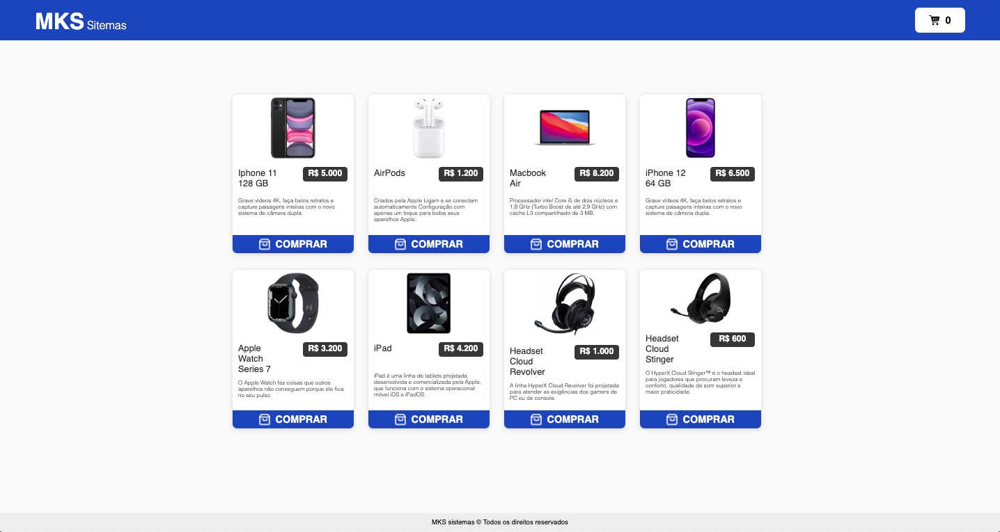
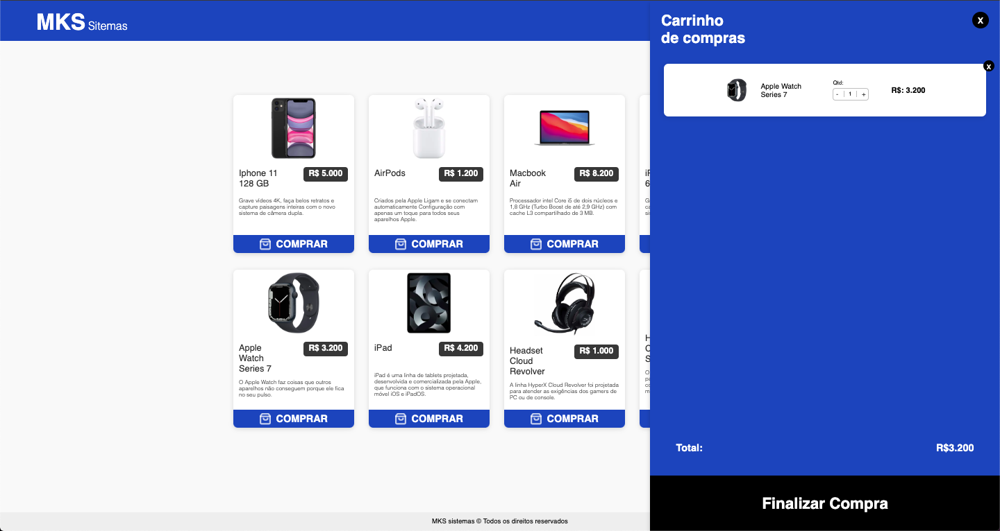
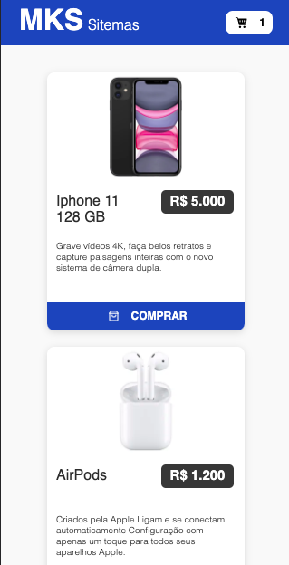
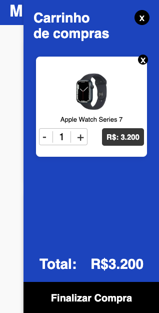

<div align="center" id="top">
  

&#xa0;

</div>

<h1 align="center">MKS Sistemas</h1>

<!-- Status -->

<!-- <h4 align="center">
	🚧  [texto] 🚀 Under construction...  🚧
</h4>
<hr> -->

<p align="center">
  <a href="#-sobre">Sobre</a> &#xa0; | &#xa0;
  <a href="#Telas">Telas</a> &#xa0; | &#xa0;
  <a href="#skateboard-funcionalidades">Funcionalidades</a> &#xa0; | &#xa0;
  <a href="#rocket-tecnologias">Tecnologias</a> &#xa0; | &#xa0;
  <a href="#white_check_mark-requisitos-para-rodar-a-aplicação">Requisitos</a> &#xa0; | &#xa0;
  <a href="https://github.com/joaotelesk" target="_blank">Autor</a>
</p>

<br>

## 🧠 Sobre

O projeto foi desenvolvido em um desafio técnico no processo seletivo da MKS Desenvolvimento de Sistemas, onde a tarefa era desenvolver um projeto de marketplace consumindo a [API](https://mks-challenge-api-frontend.herokuapp.com/api-docs/#/Product/get_products) e [designer](https://drive.google.com/file/d/15lyRgO4rwCXip5RrHZwPykzhieJ9qAVN/view?usp=share_link) de produtos disponibilizada pela empresa.

<br/>

## 📱 Telas

[Desktop]()


<br/>

[Mobile]()

<div width="100vh">
<div/>

<br/>

## 🛹 Funcionalidades

✔️ cadastrar e remover items no carrinho

✔️ abrir e fechar o menu de carrinho

✔️ incrementar e decrementar itens

<br/>

## 🚀 Tecnologias

Abaixo poderá ter acesso às principais tecnologias usadas neste projeto

- [NextJS](https://nextjs.org/)
- [TypeScript](https://www.typescriptlang.org/)
- [Redux toolkit](https://redux-toolkit.js.org/)
- [Styled-components](https://styled-components.com/)
- [jest](https://jestjs.io/pt-BR/)

## ✅ Requisitos para rodar a aplicação

Antes de iniciar 🏁, você precisa ter [Git](https://git-scm.com) e [Node](https://nodejs.org/en/) instalado em seu sistema operacional.

<br/>

## 🏁 Iniciando

```bash
# Clone este projeto
$ git clone https://github.com/joaotelesk/marketplace
# Acesse
$ cd marketplace
# Instale as dependências
$ yarn
# Execute o projeto
$ yarn start
# O projeto será inicializado em <http://localhost:3000>
```

<br/>

Feito com 💜 por <a href="https://github.com/joaotelesk" target="_blank">João Teles</a>

&#xa0;

### Vamos nos conectar?

- [instagram](https://www.instagram.com/jaootelesk)
- [linkedin](www.linkedin.com/in/joaotelesk)
- [github](https://github.com/joaotelesk)

<br />
<br />
<a href="#top">Voltar ao topo</a>
